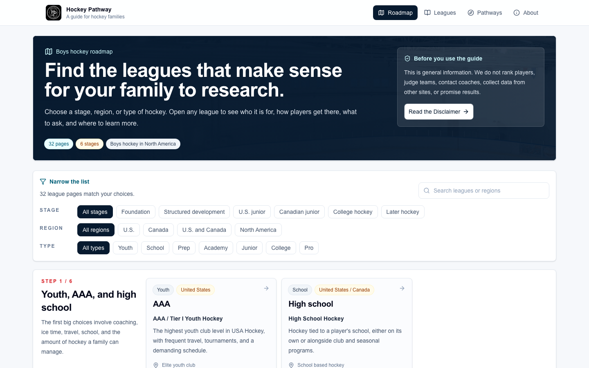

# Hockey Pathway

A free guide to how youth, prep, junior, and college hockey fit together in North America. Live at [hockeypathway.com](https://hockeypathway.com).



## Why I made it

I've played hockey for 14 years, and the path from youth hockey to junior or college is confusing even when you're inside it. AAA, prep school, USHL, CHL, NCAA, ACHA: families hear all of these and have to piece together what they mean from forums and word of mouth. I wanted one place that explains each option plainly and links to the official source.

My first version was a paid recruiting tool with accounts, player profiles, outreach tracking, and a Pro tier. After building it, I cut it down to a free, static guide. The information was the useful part, and I didn't want to charge families for it or collect data on kids.

## What's in it

- A roadmap of 32 leagues and programs across six stages, filterable by stage, region, and type
- A page for every league: who it's for, how players get there, questions to ask, and official sources
- Every league record carries a last-reviewed date and at least one official link, and a unit test enforces both

## Stack

Next.js 16 (App Router, fully static), React 19, TypeScript, Tailwind CSS 4, Vitest, Playwright, PostHog, deployed on Vercel.

## Running it

No environment variables are needed to run it locally.

```bash
npm ci
npm run dev
```

Then open http://localhost:3000.

```bash
npm test
npm run lint
npm run typecheck
npm run build
```

## What's next

- Delete the leftover pieces of the paid version: the Supabase migrations and the Stripe and auth variables in `.env.example`.
- Add girls' and women's hockey. The guide only covers the boys' path right now.
